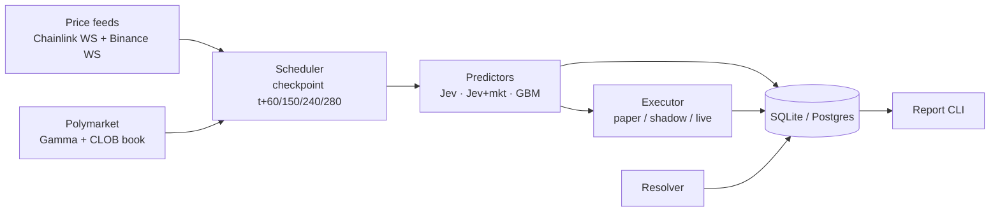
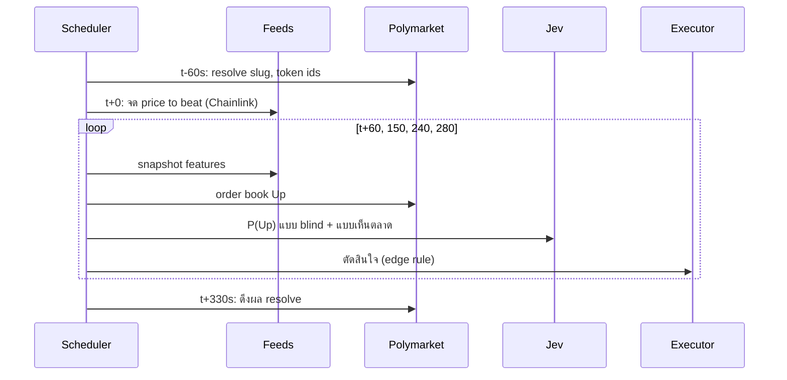

# Spec: Jev × Polymarket Crypto 5-min Bot

Sep 23, 2026 · @Someone

## 1. ภาพรวมและเป้าหมาย

บอทนี้วัดว่า Jev (TypeSafe AI) ทายผล Polymarket crypto "Up or Down" 5 นาที (BTC, ETH, SOL, HYPE)ได้แม่นกว่าราคาตลาดและสูตรคณิตศาสตร์ง่ายๆ หรือไม่ เริ่มจาก paper trade ล้วน และจะใช้เงินจริงก็ต่อเมื่อผ่านเกณฑ์ในหัวข้อ 7 เท่านั้น

คำถามที่ต้องตอบให้ได้:

1. Jev ชนะ baseline ทางคณิตศาสตร์ (random walk) ได้ไหม
2. Jev ชนะราคาตลาด Polymarket ได้ไหม และชนะช่วงไหนของรอบ (ต้น / กลาง / ท้าย)
3. หลังหักค่าธรรมเนียมและ spread ยังเหลือกำไรจำลองไหม
4. Latency ของ Jev เร็วพอใช้ในรอบ 5 นาทีไหม

ภาษาที่ใช้: Python 3.11+ เพราะ SDK ของ Jev (`langchain-typesafe`) และ client ทางการของ Polymarket (`py-clob-client`) เป็น Python ทั้งคู่ ตัว prototype `pmjev.py` ที่มีอยู่แล้วคือจุดเริ่มของ Phase 0

## 2. ขอบเขตและ Phase

เริ่มที่ 4 asset คือ BTC, ETH, SOL, HYPE เปิด/ปิดหรือเพิ่ม asset ใหม่ (เช่น XRP หรือตลาด 15 นาที) ได้ด้วยการแก้ `assets.yaml` อย่างเดียว ไม่ต้องแก้โค้ด (ดูหัวข้อ 4.1) ผลทุกอย่างแยกตาม asset

| Phase | ทำอะไร | เงินจริง | เกณฑ์ผ่านไป phase ถัดไป |
| --- | --- | --- | --- |
| 0 – Data check | รัน `--no-jev` เก็บ baseline + ราคาตลาด ตรวจว่า pipeline ไม่พลาดรอบ | ไม่ | เก็บได้ ≥ 95% ของรอบใน 24 ชม. และ resolve ครบ |
| 1 – Paper (Jev) | เปิด Jev ทั้ง 2 variant เก็บข้อมูลและรายงานผล | ไม่ | ผ่าน go/no-go ในหัวข้อ 7 |
| 2 – Shadow execution | สร้าง order จริงแต่ไม่ส่ง วัดว่าราคาที่จะได้จริงต่างจากที่คิดแค่ไหน | ไม่ | PnL จำลองยังบวกหลังคิด depth จริง 7 วัน |
| 3 – Live เล็ก | ส่ง order จริง ขนาดขั้นต่ำ มี risk limit + kill switch | เงินที่เสียได้ | ตัดสินใจหลัง 500 trades |

นอกขอบเขต: ตลาดข่าว/การเมือง, การเทรนโมเดลเอง, latency arbitrage วินาทีสุดท้าย, UI/dashboard (ใช้ report บน terminal ไปก่อน)

## 3. สถาปัตยกรรมและ Tech stack

เป็น process เดียว แบบ asyncio แยกเป็น 5 ส่วนที่คุยกันผ่าน queue ภายใน เก็บทุกอย่างลง DB เดียว



แต่ละกล่องคือ module หนึ่งตัว Executor เปลี่ยนโหมดด้วย config เท่านั้น

| ส่วน | เลือกใช้ |
| --- | --- |
| ภาษา | Python 3.11+, asyncio |
| HTTP / WS | `httpx`, `websockets` |
| Jev | `langchain-typesafe` (`TypeSafeClassifier`, `Noul`) |
| Polymarket trading | `py-clob-client` (Phase 2–3 เท่านั้น) |
| Storage | SQLite ตอน paper, ย้ายไป Supabase Postgres เมื่อรันบน server |
| Config | `pydantic-settings` + `.env` |
| Deploy | Railway (worker ตัวเดียว ไม่มี web) |

โครงสร้างโฟลเดอร์:

```
pmjev/
  config.py          # settings, thresholds, mode
  feeds/chainlink.py # Polymarket live-data WS (resolution source)
  feeds/binance.py   # klines + trade WS (BTC/ETH/SOL features)
  feeds/hyperliquid.py # candles + trades (HYPE features)
  assets.py          # load assets.yaml -> AssetConfig
  market/gamma.py    # slug -> event, token ids, outcome
  market/clob.py     # order book, (live) orders
  features.py        # state builder
  predictors/jev.py
  predictors/gbm.py
  executor.py        # paper | shadow | live
  risk.py            # limits, kill switch
  resolver.py
  store.py           # schema + queries
  report.py
  main.py            # scheduler loop
tests/
```

## 4. แหล่งข้อมูลและ API

แหล่งที่สำคัญที่สุดคือ Chainlink stream เพราะเป็นแหล่งที่ Polymarket ใช้ resolve จริง Binance ใช้เป็น feature และ fallback

| แหล่ง | Endpoint | ใช้ทำอะไร | Auth |
| --- | --- | --- | --- |
| Gamma API | `GET gamma-api.polymarket.com/events?slug=btc-updown-5m-{ts}` | หา event, `clobTokenIds`, `outcomes`, ผล resolve (`outcomePrices`, `closed`) | ไม่ต้อง |
| CLOB | `GET clob.polymarket.com/book?token_id=` | best bid/ask ของ Up และ depth | ไม่ต้อง (อ่าน) / API key (ส่ง order) |
| Polymarket live data WS | `ws-live-data.polymarket.com`, topic `crypto_prices_chainlink`, symbol `btc/usd` | ราคา Chainlink ที่ใช้ resolve และ price to beat | ไม่ต้อง |
| Binance | `/api/v3/klines` (1s, 1m), trade WS `btcusdt@trade` | returns, volatility, order flow | ไม่ต้อง |
| TypeSafe Jev | `TypeSafeClassifier().invoke({state, questions})`, model `jev-latest` | P(Up) แบบ `Noul` | `TYPESAFE_API_KEY` |

การหาตลาดไม่ต้องค้น: slug คำนวณจากเวลา `window_start = now - (now % 300)` และรอบปิดที่ `window_start + 300` Polymarket ลิสต์ตลาดล่วงหน้าไว้ประมาณ 24 ชม. ([spec ชุมชน](https://github.com/AllAboutAI-YT/polymarket_bot_beginner/blob/main/research/btc_5min_market_spec.md))

ต้องตรวจก่อนเขียนโค้ด (ยังไม่ได้ยืนยันกับ API จริง):

- [ ] รูปแบบ message ของ live-data WS และวิธี subscribe
- [ ] price to beat ของ Polymarket คือ tick Chainlink ตัวไหน (แรกหลัง `window_start` หรือก่อน)
- [ ] ตารางค่า taker fee ปัจจุบันของตลาด 5 นาที และ rebate ของ maker
- [ ] rate limit และราคาต่อ request ของ Jev
- [ ] เงื่อนไขการใช้งาน Polymarket สำหรับผู้ใช้ในไทย (ก่อน Phase 3)

### 4.1 Asset config (`assets.yaml`)

แต่ละ asset คือบล็อกเดียวในไฟล์เดียว ค่าใน `defaults` ใช้กับทุก asset และ override รายตัวได้ โค้ดอ่านไฟล์นี้แล้ว validate ด้วย pydantic ตอนเริ่ม ผิดรูปแบบ = ไม่ยอมรัน

```yaml
defaults:
  window_seconds: 300          # 900 = ตลาด 15 นาที
  checkpoints: [60, 150, 240, 280]
  edge: 0.03
  stake_usd: 5
  jev: { enabled: true, market_variant: true }

assets:
  btc:
    enabled: true
    slug_prefix: btc-updown-5m
    chainlink_symbol: btc/usd
    feature_source: { type: binance, symbol: BTCUSDT }
  eth:
    enabled: true
    slug_prefix: eth-updown-5m
    chainlink_symbol: eth/usd
    feature_source: { type: binance, symbol: ETHUSDT }
  sol:
    enabled: true
    slug_prefix: sol-updown-5m
    chainlink_symbol: sol/usd
    feature_source: { type: binance, symbol: SOLUSDT }
  hype:
    enabled: true
    slug_prefix: hype-updown-5m
    chainlink_symbol: hype/usd
    feature_source: { type: hyperliquid, coin: HYPE }
    edge: 0.05                 # override: สภาพคล่องต่ำกว่า
```

กฎการทำงาน:

- slug ของรอบ = `{slug_prefix}-{window_start}` ใช้สูตรเดียวกันทุก asset
- `feature_source.type` เลือก adapter ใน `feeds/` เพิ่มแหล่งใหม่ = เขียน adapter 1 ไฟล์ที่มี `candles()` และ `trades()`
- override ชั่วคราวผ่าน env ได้ เช่น `ASSETS=btc,hype` เปิดเฉพาะ 2 ตัวนี้
- ทุก checkpoint ทำทุก asset พร้อมกันด้วย `asyncio.gather` asset ใด error ไม่กระทบตัวอื่น
- HYPE ไม่ใช้ Binance แต่ดึง candle/trade จาก Hyperliquid info API (`candleSnapshot`) ตลาด HYPE resolve ด้วย Chainlink HYPE/USD ([กฎตลาด](https://accrue.com/m/hype-updown-5m-1780098600))

ต้องตรวจ: slug ของ ETH/SOL เป็น `eth-updown-5m` / `sol-updown-5m` จริง และ live-data WS มี symbol `hype/usd`

## 5. Flow ต่อรอบ 5 นาที

ทุกรอบมี 4 checkpoint แต่ละจุดทำงานเหมือนกัน: snapshot → ทำนาย 3 แบบ → ตัดสินใจ → บันทึก ทั้งหมดต้องจบใน 2 วินาที



จด price to beat เองตอน t+0 จาก Chainlink ถ้า WS ขาดช่วง t+0 ให้ mark รอบนั้นเป็น `no_open` และไม่นับในผล

**Features (state ที่ส่งเข้า Jev)** เป็น JSON ตัวเลขล้วน + กฎตลาด 1 ประโยค:

- `price_to_beat`, `spot`, `pct_from_price_to_beat`, `seconds_remaining`
- return ย้อนหลัง 10s / 30s / 60s / 5m / 15m / 60m (%)
- realized volatility 60 นาที (% ต่อนาที)
- order flow 60s จาก feature source ของ asset นั้น: buy volume / total volume
- ส่วนต่าง Chainlink − feature source (bps)
- เฉพาะ variant `jev_mkt`: `polymarket_up_bid/ask/mid`

**Jev request** คำถามเดียว type `Noul`:

```python
questions = {"up": Noul(instructions=
  "When this 5-minute window closes, the price will be >= price_to_beat, "
  "so the market resolves Up.")}
p_up = clf.invoke({"state": state, "questions": questions}).nouls["up"].noul
```

variant blind กับ variant เห็นตลาดต้องเป็นคนละ request เพราะ state ต่างกัน ยิงพร้อมกันแบบ async ตั้ง timeout 1.5 วินาที ถ้า timeout บันทึกเป็น null ไม่ retry

**Baseline GBM** (ไม่ใช้ AI) โดย σ = volatility ต่อวินาที, τ = วินาทีที่เหลือ:

```latex
P_{\text{up}} = \Phi\left(\frac{\ln(S / K)}{\sigma\sqrt{\tau}}\right)
```

**กฎตัดสินใจ (ต่อโมเดล)**: ซื้อ Up เมื่อ `p − ask_up − fee(ask_up) > edge` ซื้อ Down เมื่อ `(1 − p) − ask_down − fee(ask_down) > edge` ค่าเริ่ม `edge = 0.03` และเข้าไม่เกิน 1 ครั้งต่อรอบต่อโมเดล (checkpoint แรกที่ผ่านเกณฑ์)

Paper exit ใช้เฉพาะ probability ของโมเดลที่เปิด position และตรวจเฉพาะ checkpoint
ถัดไป: ขาย Up เมื่อ `p < bid_up − fee(bid_up)` หรือขาย Down เมื่อ
`1 − p < bid_down − fee(bid_down)`. ถ้า bid ที่ต้องใช้ไม่มี ให้ถือ position ต่อ;
การปิด position ไม่อนุญาตให้โมเดลเดิมเข้าใหม่ในรอบเดียวกัน

## 6. Data model

ใช้ 3 ตาราง แยกรอบ การทำนาย และ trade เก็บ state ที่ส่งเข้า Jev แบบเต็มทุกครั้งเพื่อ replay ได้

```sql
CREATE TABLE windows (
  slug TEXT PRIMARY KEY,          -- btc-updown-5m-<ts>
  asset TEXT, window_start INTEGER,
  up_token TEXT, down_token TEXT,
  price_to_beat REAL,             -- Chainlink at t+0
  close_price REAL,
  outcome INTEGER,                -- 1 Up, 0 Down, NULL pending
  status TEXT                     -- open | no_open | resolved | error
);

CREATE TABLE predictions (
  id INTEGER PRIMARY KEY,
  slug TEXT REFERENCES windows(slug),
  t_elapsed INTEGER,              -- 60 | 150 | 240 | 280
  ts REAL,
  spot_chainlink REAL, spot_binance REAL, sigma_1s REAL,
  up_bid REAL, up_ask REAL, down_bid REAL, down_ask REAL, depth_ask_usd REAL,
  p_jev REAL, p_jev_mkt REAL, p_gbm REAL,
  jev_latency_ms REAL, jev_error TEXT,
  state_json TEXT
);

CREATE TABLE trades (
  id INTEGER PRIMARY KEY,
  prediction_id INTEGER REFERENCES predictions(id),
  model TEXT, mode TEXT,          -- paper | shadow | live
  side TEXT, price REAL, size REAL, fee REAL,
  order_id TEXT, fill_price REAL, pnl REAL,
  exit_price REAL, exit_fee REAL
);
```

## 7. การประเมินผลและ Go/No-go

ผ่านไป Phase 2 ได้เมื่อ Jev ชนะทั้ง GBM และราคาตลาดอย่างมีนัยสำคัญ และ PnL จำลองหลังค่าธรรมเนียมยังบวก ขาดข้อใดข้อหนึ่ง = ไม่ผ่าน

| Metric | วัดอะไร | เกณฑ์ผ่าน |
| --- | --- | --- |
| จำนวนข้อมูล | รอบที่ resolve แล้ว | ≥ 1,500 รอบต่อ asset (\~5 วัน) ครอบคลุมช่วงตลาดนิ่งและวิ่งแรง |
| Brier score | ความแม่นของความน่าจะเป็น แยกตาม checkpoint | Jev < GBM และ Jev < market ที่ checkpoint เดียวกัน |
| นัยสำคัญ | paired bootstrap ของส่วนต่าง Brier (สุ่มระดับรอบ 2,000 ครั้ง) | 95% CI ไม่คร่อม 0 |
| Log loss | ลงโทษความมั่นใจผิดทาง | ไม่แย่กว่า market |
| Calibration | 10 bucket: ทำนาย vs เกิดจริง | คลาดทุก bucket < 5 จุด |
| PnL จำลอง | ซื้อที่ ask หัก fee, 1 share/trade | บวก และยังบวกเมื่อเพิ่มค่า fee สมมติ 1.5 เท่า |
| Latency | p95 ของ Jev | < 1,000 ms |

การอ่านผล: Jev แพ้ GBM = ไม่ได้ดึงอะไรเพิ่มจากข้อมูลราคา, `p_jev_mkt` เท่ากับ market = แค่ลอกตลาด, ชนะเฉพาะบาง checkpoint = จำกัดการเทรดไว้เฉพาะช่วงนั้น

## 8. Phase Live: Execution และ Risk

โหมด live เปิดได้เมื่อตั้ง `MODE=live` และ `MAX_NOTIONAL_USD` ชัดเจนทั้งคู่ ถ้าขาดอย่างใดอย่างหนึ่ง process ต้องไม่ยอมเริ่ม

**Execution**

- ใช้ `py-clob-client` ส่ง limit order แบบ FOK ที่ราคา ask ที่เห็น ไม่ไล่ราคา
- ขนาดต่ำสุดตามตลาด (ประมาณ 5 shares) ไม่เกินขนาดที่ตั้งไว้
- ถือจน resolve ไม่ขายก่อน แล้ว redeem อัตโนมัติ
- ทางเลือกภายหลัง: โหมด maker วาง limit ต่ำกว่า ask เพื่อเลี่ยง taker fee

**Risk limits** (ค่าเริ่มต้น ปรับใน config)

| Limit | ค่าเริ่ม |
| --- | --- |
| เงินต่อ trade | $5 |
| เงินค้างรวมทุกรอบ | $20 |
| ขาดทุนสูงสุดต่อวัน | $25 → หยุดถึงเที่ยงคืน UTC |
| แพ้ติดกัน | 8 ครั้ง → หยุด 1 ชม. |
| ขาดทุนสะสมจากจุดสูงสุด | $100 → หยุดถาวรจนกว่าจะ reset เอง |

**Kill switch**: หยุดส่ง order ทันทีเมื่อ Chainlink feed เงียบเกิน 10 วินาที, Jev error เกิน 20% ใน 30 นาที, หรือมีไฟล์ `STOP` ใน working dir ตัวเลขทั้งหมดข้างบนเป็นค่าตัวอย่าง ไม่ใช่คำแนะนำการลงทุน

## 9. Config, Deploy, Monitoring

ทุกค่าอยู่ใน `.env` ไม่มีค่า hard-code ในโค้ด private key ของ wallet ใช้เฉพาะ Phase 3 และใช้ wallet แยกที่มีเงินแค่เท่าที่เสียได้

```
MODE=paper                # paper | shadow | live
ASSETS=btc,eth,sol,hype   # ว่าง = ตาม enabled ใน assets.yaml
CHECKPOINTS=60,150,240,280
ENTRY_CHECKPOINTS=150,240
EXIT_CHECKPOINTS=240,280
JEV_ENABLED=true
JEV_MARKET_VARIANT=true
JEV_TIMEOUT_S=1.5
TYPESAFE_API_KEY=
EDGE=0.03
FEE_PEAK=0.018
DB_URL=sqlite:///pmjev.sqlite
# live only
POLY_PRIVATE_KEY=
MAX_NOTIONAL_USD=
STAKE_USD=5
DAILY_LOSS_LIMIT_USD=25
```

Deploy: Railway worker 1 ตัว region ใกล้ Polymarket/Binance (US-East หรือ EU) เพื่อลด latency และใช้ Postgres แทน SQLite เพราะ disk ของ container ไม่ถาวร

Monitoring:

- log 1 บรรทัดต่อ checkpoint (slug, mkt, jev, gbm, latency)
- สรุปรายชั่วโมงส่ง Telegram: รอบที่เก็บได้ / พลาด, Brier สะสม, PnL จำลอง
- alert ทันทีเมื่อ feed หยุด, พลาดเกิน 3 รอบติด, หรือ kill switch ทำงาน
- `python -m pmjev report` สรุปผลตามหัวข้อ 7 บน terminal

## 10. Milestones และความเสี่ยง

เป้าคือรู้ผล go/no-go ของ Phase 1 ภายในประมาณ 2 สัปดาห์หลังได้ API key ของ Jev

- [ ] M1: refactor `pmjev.py` เป็นโครงสร้างหัวข้อ 3 + เพิ่ม Chainlink WS และตาราง `windows` (1–2 วัน)
- [ ] M2: Phase 0 รัน `--no-jev` 24 ชม. บน Railway ตรวจอัตราเก็บข้อมูล
- [ ] M3: ได้ Jev API key → Phase 1 เก็บ ≥ 1,500 รอบ
- [ ] M4: report + bootstrap → ตัดสิน go/no-go
- [ ] M5 (ถ้า go): Phase 2 shadow 7 วัน → Phase 3 live เล็ก

| ความเสี่ยง | ผลกระทบ | รับมือ |
| --- | --- | --- |
| ราคา 5 นาทีเกือบเป็น random walk | Jev อาจไม่มี edge เลย | คือสิ่งที่กำลังทดสอบ ผล no-go ก็มีค่า |
| คู่แข่ง HFT และบอท | edge ที่เห็นใน paper หายตอน live | Phase 2 shadow วัด fill จริงก่อน |
| Taker fee สูงสุดช่วงราคา 0.50 | กินกำไรส่วนใหญ่ | ทดสอบ PnL ที่ fee ×1.5, พิจารณาโหมด maker |
| Jev เป็น early access | API เปลี่ยน / ถูกจำกัด | แยก `predictors/jev.py` เป็น adapter, บันทึก `model` ทุกแถว |
| Binance ≠ Chainlink | feature คลาดในรอบที่ปิดใกล้ price to beat | ใช้ Chainlink เป็นหลัก, เก็บส่วนต่างเป็น feature |
| เงื่อนไขการใช้งานตามประเทศ | เทรดจริงไม่ได้ | ตรวจก่อน Phase 3 |
